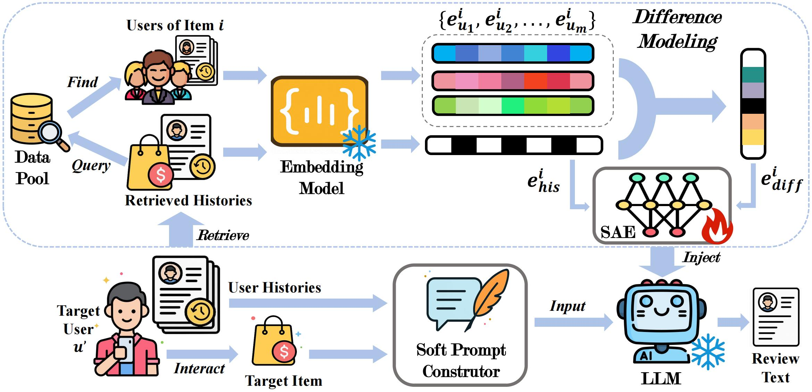
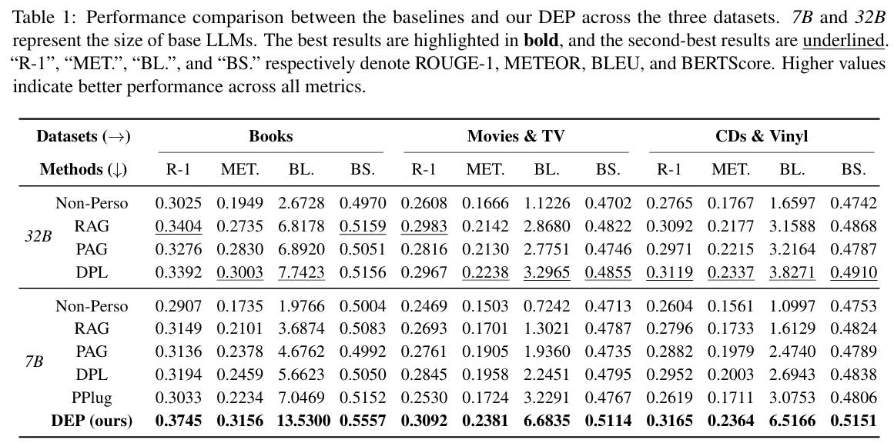

<div align=center>

<h1>Latent Inter-User Difference Modeling for LLM Personalization</h1>

[](https://arxiv.org/abs/2507.20849) [](https://huggingface.co/datasets/SnowCharmQ/DEP-model) 

<div>
    <a href="https://snowcharmq.github.io/" target="_blank">Yilun Qiu</a><sup>1</sup>,
    <a href="https://data-science.ustc.edu.cn/_upload/tpl/15/04/5380/template5380/author/tianhao-shi.html" target="_blank">Tianhao Shi</a><sup>2</sup>,
    <a href="https://xyzhao01.github.io/" target="_blank">Xiaoyan Zhao</a><sup>3</sup>,
    <a href="https://fengbinzhu.github.io/" target="_blank">Fengbin Zhu</a><sup>1</sup>,
    <a href="https://zyang1580.github.io/" target="_blank">Yang Zhang</a><sup>1</sup>,
    <a href="https://fulifeng.github.io/" target="_blank">Fuli Feng</a><sup>2</sup>,

<div>
  <sup>1</sup>National University of Singapore, <sup>2</sup>University of Science and Technology of China, <sup>3</sup>The Chinese University of Hong Kong
</div>   
<div>
</div>

</div>
</div>

<br/>

This is the implementation of the Difference-aware Embedding-based Personalization (DEP) method proposed in our paper.




<p id="Catalogue"></p>  

## 📋 Catalogue 

- [📋 Catalogue](#-catalogue)
- [⚙️ Environment Setup](#️-environment-setup)
- [📚 Dataset Preprocess](#-dataset-preprocess)
- [⌛️ Quick Start](#️-quick-start)
    - [Evaluation](#evaluation)
    - [Training](#training)
- [📊 Experimental Results](#-experimental-results)
- [📖 Citation](#-citation)

## ⚙️ Environment Setup

```
bash install.sh
```
Feel free to take a look at `install.sh` to see what you need to run our project.

## 📚 Dataset Preprocess

The dataset we used in DEP is adapted from [Amazon Reviews'23](https://amazon-reviews-2023.github.io/) and [DPL](https://github.com/SnowCharmQ/DPL).

```
bash run-create.sh
```

## ⌛️ Quick Start

#### Evaluation

To evaluate the performance of DEP, simply run the following command:

```
bash run-eval.sh
```

The evaluation script will download the model automatically from the Huggingface and test it.

#### Training

To train the model and select best-performing model, simply run the following commands:

```
bash run-train.sh
bash run-select.sh
```
It takes around 3 hours to train the model in a single H100.

## 📊 Experimental Results



## 📖 Citation

If you find our work useful, please kindly cite our paper:

```
@article{qiu2025latent,
  title={Latent Inter-User Difference Modeling for LLM Personalization},
  author={Qiu, Yilun and Shi, Tianhao and Zhao, Xiaoyan and Zhu, Fengbin and Zhang, Yang and Feng, Fuli},
  journal={arXiv preprint arXiv:2507.20849},
  year={2025}
}
```